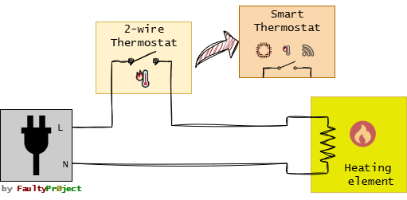
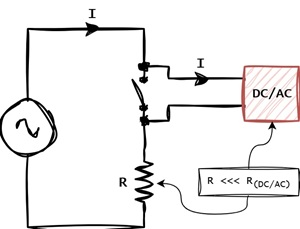
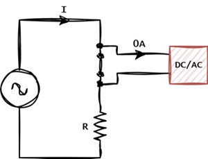
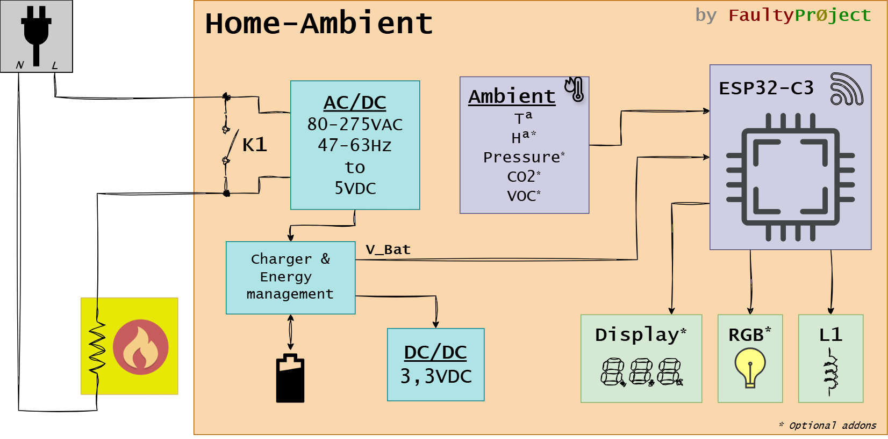
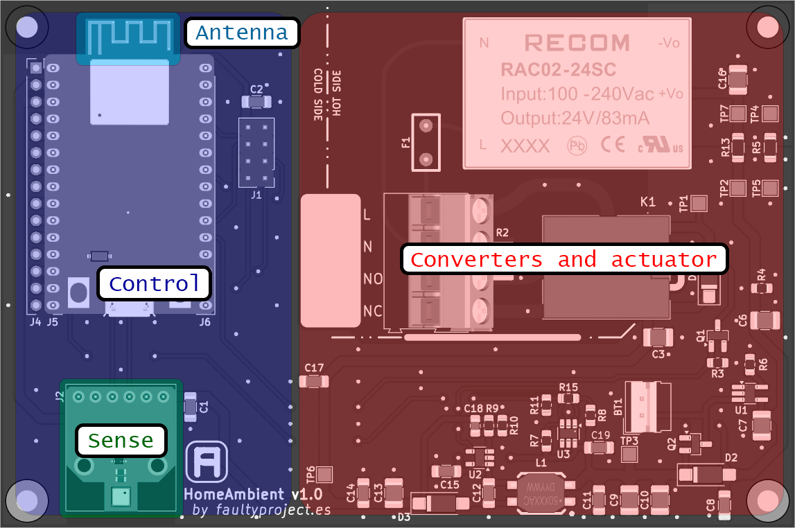
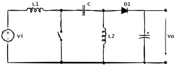
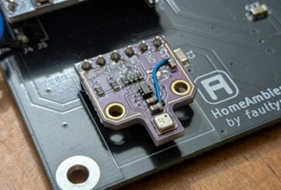
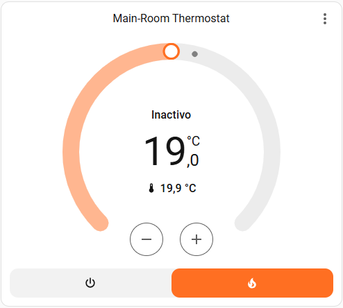
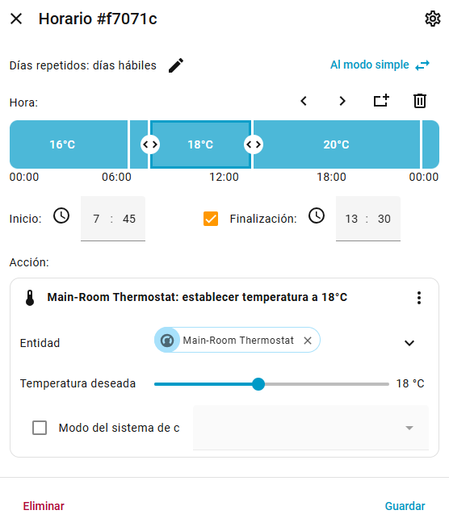

# Home-Ambient
 2-wire smart home thermostat with temperature, humidity, pressure and air quality measurements.

The main target is replace traditional tow wires bimetal thermostats with an intelligent one, cable to integrate with [HomeAssistance](https://www.home-assistant.io/) or works _standalone_ with custom firmware.

## 2-wire classical thermostat replacement

### Working principle
Images below explain graphically how this system works.

The main and mandatory system requirement is a big difference between Control an Load level power. While load is some orders of magnitud above, there should not be problem, but is mandatory review every case.

# Product Requirements

| Requirement   | Description  | Definition |
|:-------------:|:-------------|:----------:|
| Temperature	|  Temperature measurement, with minimal interference from the device.	| ±2°C 	|
| Humidity	| Humidity measurement from ambient 	| ±5% 	|
| Air quality	| Air quality estimation by particle detection| Not defined, optional |
| Switch	| 2 pole switch	| >=10A	|
| Switch feedback	| Switch feedback to check operation | Digital or analog |
| HA | Home Assistance integration	| Mandatory	|
| Display | Optional e-Ink display	| No power relevant|
| Autonomy | Capable to operate without power	| At least 2h |

## Hardware architecture
Home-Ambient block diagram is show on image below.

The PCB hardware distribution is proposed on next image.

### Power supply, SEPIC converter
Energy when the load is activated is provided by a battery. The voltage from this power source varies from above and below 3,3V, so it is neccesary _'boost'_ and _'buck'_ converter.
Here is where the SEPIC converter comes to action, capable of manage both situations at the same time.

### CPU
The easiest way to integrate custom electronics on _HomeAssistant_ are the [ESPHome](https://esphome.io/) devices. This smart thermostat will be designed around classical [ESP32-C3](https://www.espressif.com/en/products/socs/esp32-c3).

### Sensors and actuators
The BME680 air quality sensor covers all requirements. More info about this component can be found on [Bosch official website](https://www.bosch-sensortec.com/en/products/environmental-sensors/gas-sensors/bme680).

## Home Assistant integration
As said before, integration is done by [ESPHome](https://esphome.io/), there is no easier way to do this.

After integration on Home-Assistant, a schedule programmer is implemented using the [Niels Faber](https://github.com/nielsfaber) tools.

# More info on [FaultyProject](https://faultyproject.es/)
If you are interested how this project was developed take a look on the next links:
 1. [Introduction](https://faultyproject.es/proyectos/home-ambient/home-ambient-intro/)
 2. [Prototype](https://faultyproject.es/proyectos/home-ambient/home-ambient-prototipo/)
 3. [Schematichs & PCB Design](https://faultyproject.es/proyectos/home-ambient/home-ambient-hardware-esquema-y-pcb/)
 4. [Home Assistant Integration](https://faultyproject.es/proyectos/home-ambient/home-ambient-integracion-con-home-assistant-y-esphome/)
 5. Case design (Comming soon... )
